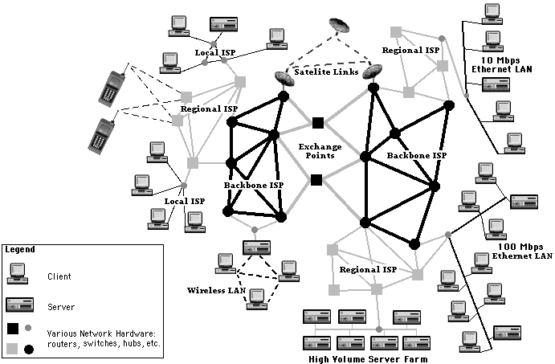
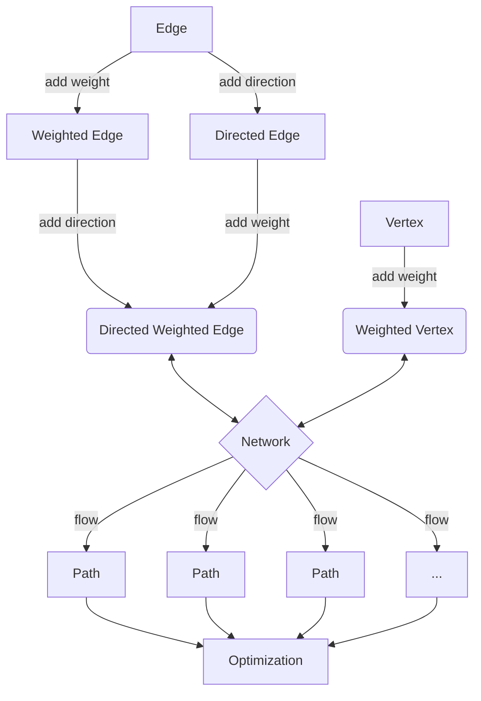
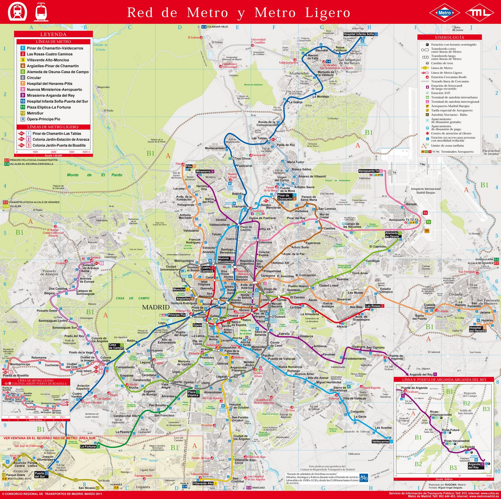
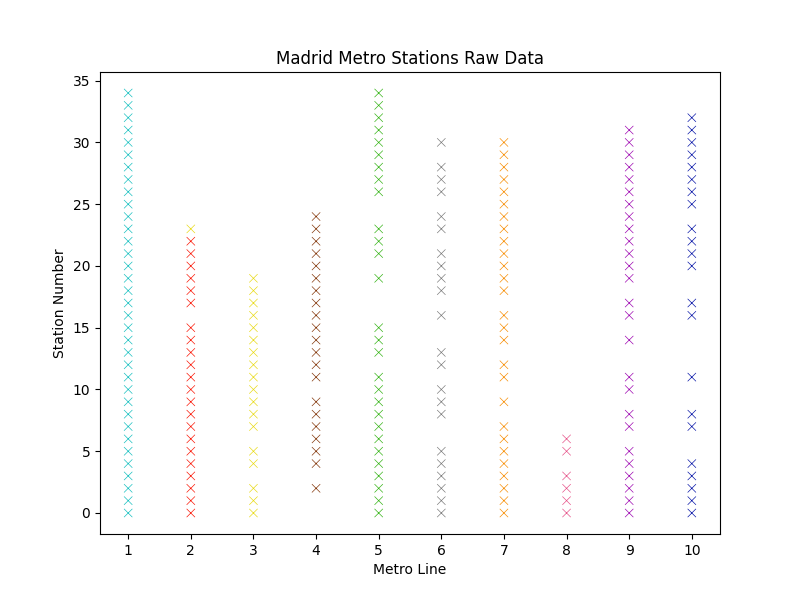
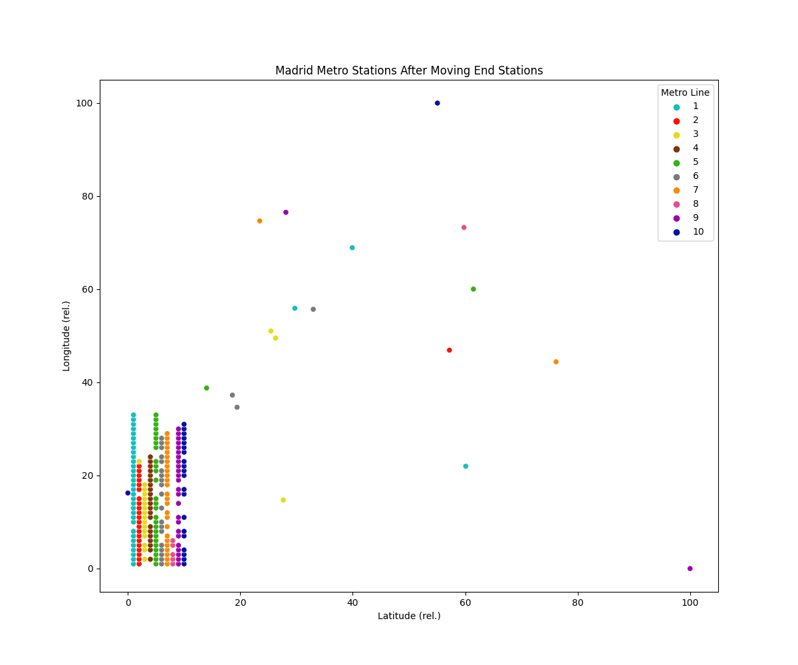
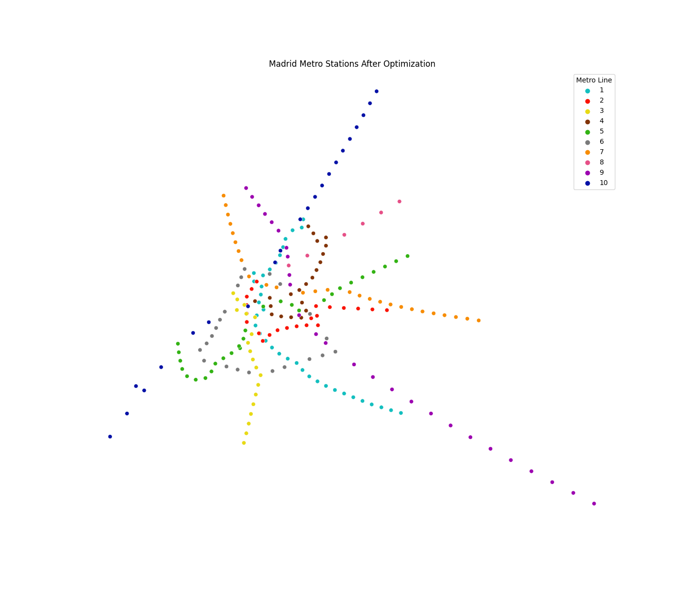

# Network Optimisation

## The Network


### Structure

The network consists of two basic components.

#### Nodes

These are the individual *entities* of the network. They can represent anything from a person to a computer to a city. They are connected by **edges**. A node can hold additional information about itself. One of the most used attributes given to a node is **weight**; weight can represent the relative importance of a node with respect to its neighbours.


<div>
    <p style="float: right;"></p>
</div>


Let us consider an **example** of a node; a person. A person can be connected to other people, forming a social network. A person can also be connected to a server, forming a network of people and servers. Each individual could be assigned a weight, that can be ascribed a physical meaning. A simple example of a weight could be the **degree** of the node, that is, the amount of total connections that person has. However, we can also ascribe a different meaning, such as the amount of money that person has. In this latter case, note that the weight could be negative as well as any real number. A server could also be assigned a different type of weight, such as its current server load - if it were at capacity, then sending information to it would 'bounce back'.


#### Edges

An **edge** is the connection between two nodes. A node can also be connected to itself via an edge, forming a **loop**. More generally, a **cycle** is a path that begins and ends at the same node without passing through the same edges. Further, we will also allow for **multi-edges**, where consider two or more distinct edges between the same two nodes.

Much like nodes, we can also assign different types of information to edges. We can assign a **weight** to an edge, which can represent its *flow capacity*. We can also assign a **direction** to an edge, which can represent the *direction of flow*.

For **example**, a person could be connected to a server via an edge, where the direction of the edge represents the direction of information flow. In this case, the person is the *source* of the information, and the server is the *destination* of the information. The server can answer back to the person in the opposite direction. This creates a *directed multi-edge network* between the node and the server. The weight of the edge can represent the amount of information that can be sent from the person to the server and vice versa. Since the weights need not be the same, we have *asymmetric connections* which simulate a network with a **bottleneck**.



### Implementation (Python)

There are 3 basic classes that we will use to implement the network. The first is the **Node** class, which represents a node in the network. The second is the **Edge** class, which represents an edge in the network. The third is the **Network** class, which represents the network itself and is the container for the nodes and edges.

#### Approach

The approach that we will take is to create a **base class** for each of the three classes, and then create **derived classes** that inherit from the base classes. This allows us to create a **generic** framework that can be used to implement different types of networks. The base classes will contain the basic functionality that is common to all networks. The derived classes will contain the additional functionality that is specific to the type of network that we are implementing.

To ensure maximal generality, we will use **inheritance** to create the derived classes. This allows us to create a **hierarchy** of classes, where the derived classes inherit from the base classes. This allows us to create a **generic** framework that can be used to implement different types of networks.

Furthermore, for most of the generic class attributes, we will use a functional approach to set its value. This allows us to **override** the function in the derived classes, and thus change the behaviour of the attribute, as well as adding dynamicity to the class.

#### Node

The Node class is a simple class that represents a node in the network. It has a single attribute that is instantiated when the object is created, that being its **id**, a unique identifier for the node. For this, we generate a random 128-bit string using the **uuid** module. The id is used to identify the node in the network, and will also be especially useful when we implement the edge class.

Since we will often want to access the id of the node, we will create a **getter** function for the id. This will allow us to access the id of the node without having to access the attribute directly. This is useful since we can then **override** the getter function in the derived classes, and thus change the behaviour of the id attribute. This is especially useful when we want to change the id of the node to something more meaningful, such as the name of the node.

Since for the most part, we will almost always consider our nodes to be weighted and/or located in a space, we will instantiate the node with a **weight** and **location** attribute with **None** functional value.

The **Node class** is implemented as follows:

```python

from uuid import uuid4

constant_fn = lambda x: lambda y: x # constant function
# E.g.:   constant_fn(x)(y) = x

class Node:
    def __init__(self):
        self.id = uuid4().hex # generate a random 128-bit string
        self.loc = constant_fn(None) # location of the node
        self.weight = constant_fn(None) # weight of the node
```

#### Edge

The Edge class represents a link between two nodes. It has two attributes that are required to instantiate the object, that being its **source** and **destination** nodes. We use the **id** attribute of the node to identify the nodes between which the edge is created when considering the network.

Furthermore, we will also instantiate the edge with a unique **id** attribute, as well as a **weight** attribute with a **None** functional value and a **direction** attribute set by default to $0$. Direction is represented by an integer, where $0$ represents no direction, $1$ represents a directed edge from the source to the destination, and $-1$ represents a directed edge from the destination to the source.

The **Edge class** is implemented as follows:

```python

class Edge:
    def __init__(self, source, destination):
        self.id = uuid4().hex # generate a random 128-bit string
        self.source = source.id # source node
        self.destination = destination.id # destination node
        self.weight = constant_fn(None) # weight of the edge
        self.direction = constant_fn(0) # direction of the edge
```

#### Network

The Network class represents the network itself. It is a container for the nodes and edges in the network. It has two attributes that are required to instantiate the object, those being its **nodes** and **edges**, the latter of which can default to **None** (Note that an edge cannot be in the network if its corresponding nodes aren't as well). The nodes and edges are stored in lists containing the entire object itself. However, we will also create a **dictionary translator** that maps the **id** of the node/edge to the object itself. This will allow us to access the node/edge by its id, which should significantly improve efficiency.

Further, to improve efficiency and reduce computation, on class instantiation, we will also create two additional dictionaries - the first contains node **locations** as keys, and their id as values. Since only one node can occupy a location, this will allow us to quickly check if a location is occupied and/or retrieve the node in question. The second dictionary contains the entire **adjacency** information of the network. This will allow us to quickly check if two nodes are connected by an edge, together with direction information.

The **Network class** is implemented as follows:

```python

class Network:
    def __init__(self, nodes, edges=None):
        self.nodes = nodes # list of nodes
        self.edges = edges if edges else [] # list of edges
        self.node_dict = {node.id: node for node in nodes} # dictionary of nodes
        self.edge_dict = {edge.id: edge for edge in edges} # dictionary of edges
        self.node_loc_dict = {node.loc: node.id for node in nodes} # node locations
        self.adjacency_dict = {node.id: 
                              {node.id: {
                                         'edge' : [], 'dir_edge' : []
                                        } for node in self.nodes} 
                                          for node in self.nodes} 
        # adjacency information
        def populate_adjacency_dict():
            ...
```

### Design


### Architecture


First we create the basic framework on which we can work. We require the use of classes and inheritance to attain the maximal generality in order to fully investigate our problem.

Network architecture:




The network is a collection of vertices and edges. The vertices are connected by edges. The edges can be weighted, directed and/or weighted. The network can be used to find the optimal flow between two vertices. The flow is a path between two vertices. The flow is optimized by finding the path with the lowest weight.


## Toy Example: Recreating the Madrid Metro

We will now use the framework we have created to implement a simple network, and then use it to find an approximate position of all the metro stations in Madrid.

The only two constraints that we will have are the metro lines themselves, and the **geographical location** only of the **first** and **final node** of each line projected onto an xy-plane. The rest of the nodes will be placed with absolutely no bearing on their geographical location.



### Data Extraction

We use **Selenium** to extract the metro data from Wikipedia, and parse through the HTML to extract the station names, the metro lines they belong to, and the lines they connect to per station.

From this extraction, we obtain the names of the first and last station of each line, then extract their geographical coordinates again from Wikipedia.

### Network Creation

We create a network with the stations as nodes, and the connections between stations as edges. Since this is a simple example, *we will not consider the distance between two stations as a weight*, and we will make the naive assumption that the *stations are equidistant* (note how this toy model will still give relatively accurate predictions). We then place the entire network on an xy-plane, with no consideration for location. Note that the spaces on the vertical lines of the graph represent stations that belong to multiple metro lines (and are represented by the line with the smallest number label). Connections are not represented for visual clarity.

<div style="text-align: center;">
  
</div>

The geographical coordinates are then converted to a unitless scale using a **Mercator** projection onto a 100x100 grid. We then move the first and last station of each line to their respective transformed geographical coordinates.

<div style="text-align: center;">
  
</div>

### Algorithm: RMSE minimization

We fix in place all the endpoints, with the objective being to slowly move the rest of the nodes to their corresponding locations. We assign a set of moves that each node can perform - a cardinal move in the **N**orth/**S**outh/**E**ast/**W**est direction by a tiny amount $\epsilon$. We then calculate the **(root) mean squared error (RMSE)** between the current network configuration and the previous one. If the RMSE improved, then we try the next node. If the RMSE is not improved, we instead revert the move before continuing onto the next. We keep track of these failures, and if a node is deemed to be *stuck*, it is removed from the node pool. We repeat this process until the RMSE is minimized to a certain threshold.

```python

class Station(Node):
    def __init__(self, name):
        super().__init__()
        self.name = name
        self.cardinal_cycle = itertools.cycle(['N', 'E', 'S', 'W'])

    def cardinal_move(self, epsilon):
      self.move(self.cardinal_cycle.next(), epsilon)

    def distance(self, other):
        return np.sqrt((self.loc[0] - other.loc[0])**2 + (self.loc[1] - other.loc[1])**2)

class Connection(Edge):
    def __init__(self, station1, station2,line):
        super().__init__(station1, station2)
        self.line = line
        self.target_weight = 2 # 2 units of error, arbitrarily chosen
        self.weight = lambda x : Station.distance(x.station1, x.station2)
        # For better accuracy, we could use spherical distance instead of euclidean distance

class Metro(Network):
    def RMSE(self,station):
    error_vector = [(station.adjacent_edge.weight - station.adjacent_edge.target_weight)**2 for adjacent_edge in station.adjacent_edges]
    return np.sqrt(np.mean(error_vector))

    def optimize(self, epsilon=0.001, threshold=0.01):
        # We fix the endpoints, and move the rest of the nodes
        # We keep track of the nodes that are stuck, and remove them from the pool
        # We repeat this process until the RMSE is minimized to a certain threshold
        # We return the final RMSE
        ...

```

The intention of this algorithm is to pull the nodes towards their corresponding locations, while also allowing for some randomness in the process. The randomness is introduced by the fact that the nodes are not moved in a deterministic manner, but rather in a random order.

After a few iterations, we obtain the following plot:

<div style="text-align: center;">
  
</div>

### Results

We can see that the algorithm has successfully placed the nodes in their corresponding locations, with the exception of a few outliers. The outliers are due to the fact that the algorithm is not deterministic, and the nodes are not moved in a deterministic manner. The algorithm is also not perfect, and is prone to getting stuck in local minima. However, the algorithm is able to place the nodes in their corresponding locations with a high degree of accuracy.

Since this model was intentionally simplistic, we have no good way of measuring the accuracy of the model and its result. However, we can instead superimpose the result of the algorithm onto a map of Madrid, and visually compare it to the actual metro map.

<div style="text-align: center;">
  
</div>

Other than the northern end of line 10, most of the stations have been placed in an interpretable manner. The line 10 error can be explained due to the fact that it goes out of the city and has a snaking path. The algorithm is not able to account for this, and thus places the stations in a straight line with a singular bend. This is a limitation of the model, and is not a flaw in the algorithm.