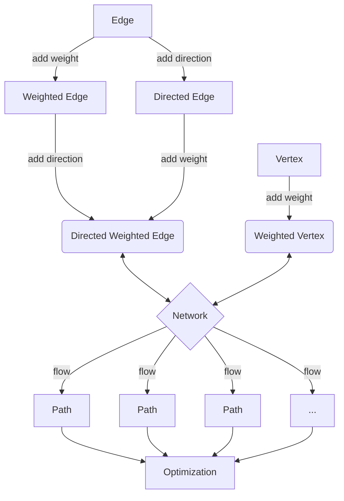

# Final-Project

## Network Optimisation

First we create the basic framework on which we can work. We require the use of classes and inheritance to attain the maximal generality in order to fully investigate our problem.

Network architecture:

The network is a collection of vertices and edges. The vertices are connected by edges. The edges can be weighted, directed and/or weighted. The network can be used to find the optimal flow between two vertices. The flow is a path between two vertices. The flow is optimized by finding the path with the lowest weight.

\[   \left\{
\begin{array}{ll}
      0 & x\leq a \\
      \frac{x-a}{b-a} & a\leq x\leq b \\
      \frac{c-x}{c-b} & b\leq x\leq c \\
      1 & c\leq x \\
\end{array} 
\right. \]

\[\mathsf C : \qquad 
\begin{matrix}
&& \vdots &&\\
& \nearrow & s & \nwarrow &\\
x_0 & \longrightarrow & \vdots & \leftarrow & x_1 \\
& \searrow & s' & \swarrow &\\
&& \vdots & 
\end{matrix} \]

\[ \bullet  \swarrow \rightarrow \]

$$ \int $$
