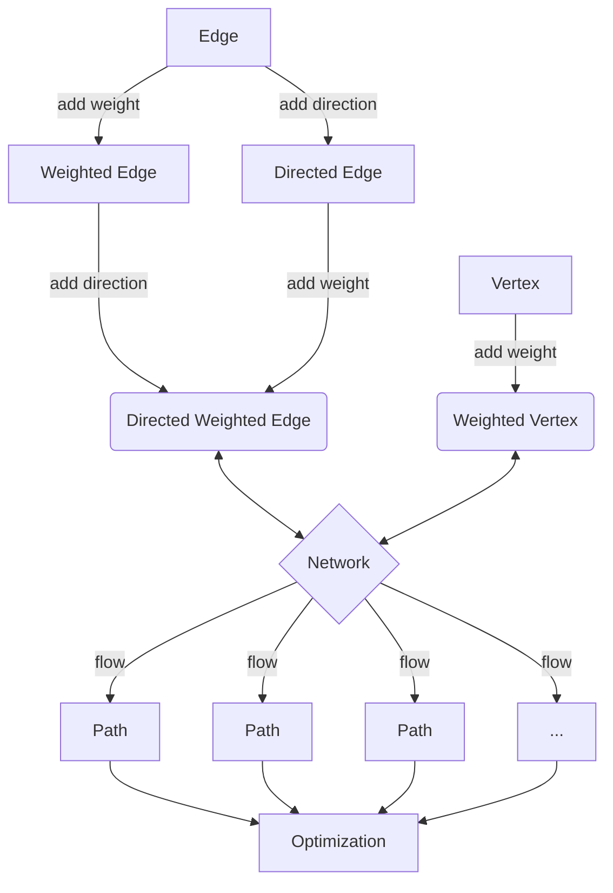

# Network Optimisation

## The Network

### Structure

The network consists of two basic components.

#### Nodes

These are the individual *entities* of the network. They can represent anything from a person to a computer to a city. They are connected by **edges**. A node can hold additional information about itself. One of the most used attributes given to a node is **weight**; weight can represent the relative importance of a node with respect to its neighbours.

Let us consider an **example** of a node; a person. A person can be connected to other people, forming a social network. A person can also be connected to a server, forming a network of people and servers. Each individual could be assigned a weight, that can be ascribed a physical meaning. A simple example of a weight could be the **degree** of the node, that is, the amount of total connections that person has. However, we can also ascribe a different meaning, such as the amount of money that person has. In this latter case, note that the weight could be negative as well as any real number. A server could also be assigned a different type of weight, such as its current server load - if it were at capacity, then sending information to it would 'bounce back'.

#### Edges

An **edge** is the connection between two nodes. A node can also be connected to itself via an edge, forming a **loop**. More generally, a **cycle** is a path that begins and ends at the same node without passing through the same edges. Further, we will also allow for **multi-edges**, where consider two or more distinct edges between the same two nodes.

Much like nodes, we can also assign different types of information to edges. We can assign a **weight** to an edge, which can represent its *flow capacity*. We can also assign a **direction** to an edge, which can represent the *direction of flow*.

For **example**, a person could be connected to a server via an edge, where the direction of the edge represents the direction of information flow. In this case, the person is the *source* of the information, and the server is the *destination* of the information. The server can answer back to the person in the opposite direction. This creates a *directed multi-edge network* between the node and the server. The weight of the edge can represent the amount of information that can be sent from the person to the server and vice versa. Since the weights need not be the same, we have *asymmetric connections* which simulate a network with a **bottleneck**.

### Implementation (Python)

There are 3 basic classes that we will use to implement the network. The first is the **Node** class, which represents a node in the network. The second is the **Edge** class, which represents an edge in the network. The third is the **Network** class, which represents the network itself and is the container for the nodes and edges.

#### Approach

The approach that we will take is to create a **base class** for each of the three classes, and then create **derived classes** that inherit from the base classes. This allows us to create a **generic** framework that can be used to implement different types of networks. The base classes will contain the basic functionality that is common to all networks. The derived classes will contain the additional functionality that is specific to the type of network that we are implementing.

To ensure maximal generality, we will use **inheritance** to create the derived classes. This allows us to create a **hierarchy** of classes, where the derived classes inherit from the base classes. This allows us to create a **generic** framework that can be used to implement different types of networks.

Furthermore, for most of the generic class attributes, we will use a functional approach to set its value. This allows us to **override** the function in the derived classes, and thus change the behaviour of the attribute, as well as adding dynamicity to the class.

#### Node

The Node class is a simple class that represents a node in the network. It has a single attribute that is instantiated when the object is created, that being its **id**, a unique identifier for the node. For this, we generate a random 128-bit string using the **uuid** module. The id is used to identify the node in the network, and will also be especially useful when we implement the edge class.

Since we will often want to access the id of the node, we will create a **getter** function for the id. This will allow us to access the id of the node without having to access the attribute directly. This is useful since we can then **override** the getter function in the derived classes, and thus change the behaviour of the id attribute. This is especially useful when we want to change the id of the node to something more meaningful, such as the name of the node.

Since for the most part, we will almost always consider our nodes to be weighted and/or located in a space, we will instantiate the node with a **weight** and **location** attribute with **None** functional value.

The Node class is implemented as follows:

```python

from uuid import uuid4

constant_fn = lambda x: lambda y: x # constant function
# E.g.:   constant_fn(x)(y) = x

class Node:
    def __init__(self):
        self.id = uuid4().hex # generate a random 128-bit string
        self.loc = constant_fn(None) # location of the node
        self.weight = constant_fn(None) # weight of the node
```

#### Edge

The Edge class represents a link between two nodes. It has two attributes that are required to instantiate the object, that being its **source** and **destination** nodes. We use the **id** attribute of the node to identify the nodes between which the edge is created when considering the network.

Furthermore, we will also instantiate the edge with a unique **id** attribute, as well as a **weight** attribute with a **None** functional value and a **direction** attribute set by default to $0$. Direction is represented by an integer, where $0$ represents no direction, $1$ represents a directed edge from the source to the destination, and $-1$ represents a directed edge from the destination to the source.

The Edge class is implemented as follows:

```python

class Edge:
    def __init__(self, source, destination):
        self.id = uuid4().hex # generate a random 128-bit string
        self.source = source.id # source node
        self.destination = destination.id # destination node
        self.weight = constant_fn(None) # weight of the edge
        self.direction = constant_fn(0) # direction of the edge
```

#### Network

The Network class represents the network itself. It is a container for the nodes and edges in the network. It has two attributes that are required to instantiate the object, that being its **nodes** and **edges**, the latter of which can default to **None**. The nodes and edges are stored in a dictionary, where the key is the id of the node/edge, and the value is the node/edge itself.

### Design


### Architecture


First we create the basic framework on which we can work. We require the use of classes and inheritance to attain the maximal generality in order to fully investigate our problem.

Network architecture:




The network is a collection of vertices and edges. The vertices are connected by edges. The edges can be weighted, directed and/or weighted. The network can be used to find the optimal flow between two vertices. The flow is a path between two vertices. The flow is optimized by finding the path with the lowest weight.

\[   \left\{
\begin{array}{ll}
      0 & x\leq a \\
      \frac{x-a}{b-a} & a\leq x\leq b \\
      \frac{c-x}{c-b} & b\leq x\leq c \\
      1 & c\leq x \\
\end{array} 
\right. \]

\[\mathsf C : \qquad 
\begin{matrix}
&& \vdots &&\\
& \nearrow & s & \nwarrow &\\
x_0 & \longrightarrow & \vdots & \leftarrow & x_1 \\
& \searrow & s' & \swarrow &\\
&& \vdots & 
\end{matrix} \]

\[ \bullet  \swarrow \rightarrow \]

$$ \int $$
