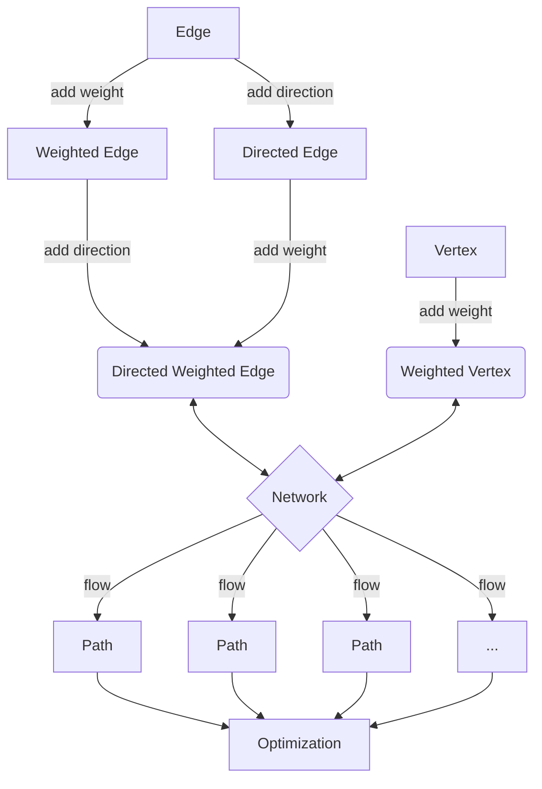

# Network Optimisation

## The Network

### Structure

The network consists of two basic components.

#### Nodes

These are the individual 'entities' of the network. They can represent anything from a person to a computer to a city. They are connected by edges. A node can hold additional information about itself. One of the most used attributes given to a node is weight; weight can represent the relative importance of a node with respect to its neighbours. 

Let us consider an example of a node; a person. A person can be connected to other people, forming a social network. A person can also be connected to a server, forming a network of people and servers. Each individual could be assigned a weight, that can be ascribed a physical meaning. A simple example of a weight could be the degree of the node, that is, the amount of total connections that person has. However, we can also ascribe a different meaning, such as the amount of money that person has. In this latter case, note that the weight could be negative as well as any real number. A server could also be assigned a different type of weight, such as its current server load - if it were at capacity, then sending information to it would 'bounce back'.

 

#### Edges

An edge is just the connection between two nodes. A node can also be connected to itself via an edge, forming a loop. More generally, a cycle is a path that begins and ends at the same node without passing through the same edges. Further, we will also allow for multi-edges, where we can consider two

A loop could represent a person who is connected to themselves, or a computer that is connected to itself.Some nodes can be connected to themselves, forming a loop. A loop is a self-referential object which can be used to give feedback to itself.

### Design

### Architecture

### Implementation

First we create the basic framework on which we can work. We require the use of classes and inheritance to attain the maximal generality in order to fully investigate our problem.

Network architecture:

The network is a collection of vertices and edges. The vertices are connected by edges. The edges can be weighted, directed and/or weighted. The network can be used to find the optimal flow between two vertices. The flow is a path between two vertices. The flow is optimized by finding the path with the lowest weight.

\[   \left\{
\begin{array}{ll}
      0 & x\leq a \\
      \frac{x-a}{b-a} & a\leq x\leq b \\
      \frac{c-x}{c-b} & b\leq x\leq c \\
      1 & c\leq x \\
\end{array} 
\right. \]

\[\mathsf C : \qquad 
\begin{matrix}
&& \vdots &&\\
& \nearrow & s & \nwarrow &\\
x_0 & \longrightarrow & \vdots & \leftarrow & x_1 \\
& \searrow & s' & \swarrow &\\
&& \vdots & 
\end{matrix} \]

\[ \bullet  \swarrow \rightarrow \]

$$ \int $$
