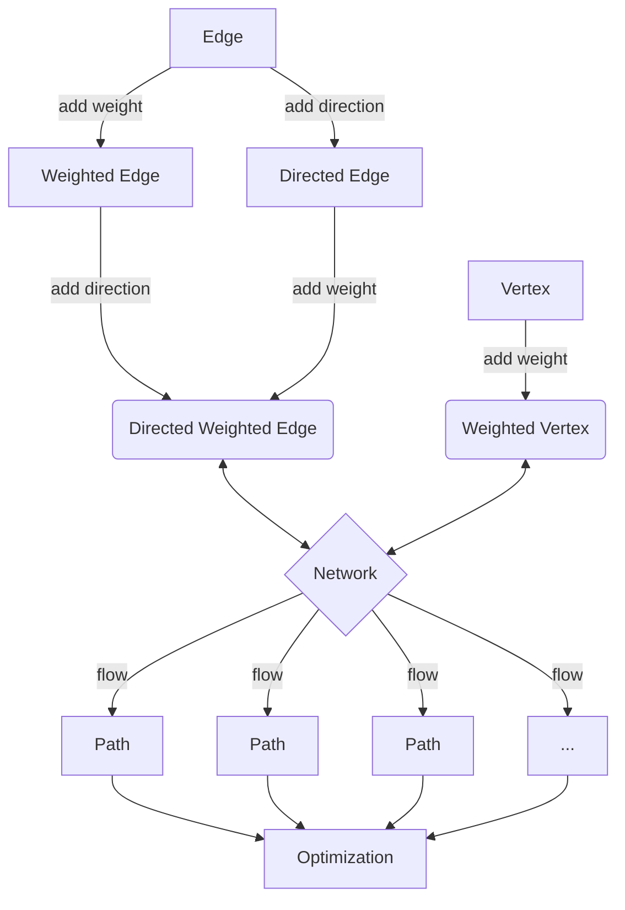

# Final-Project

## Network Optimisation

First we create the basic framework on which we can work. We require the use of classes and inheritance to attain the maximal generality in order to fully investigate our problem.

Network architecture:

