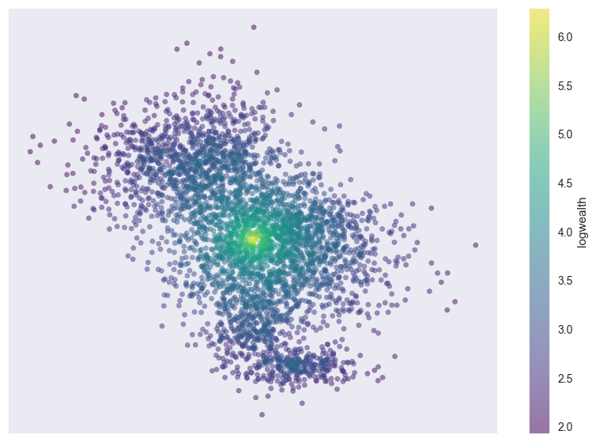
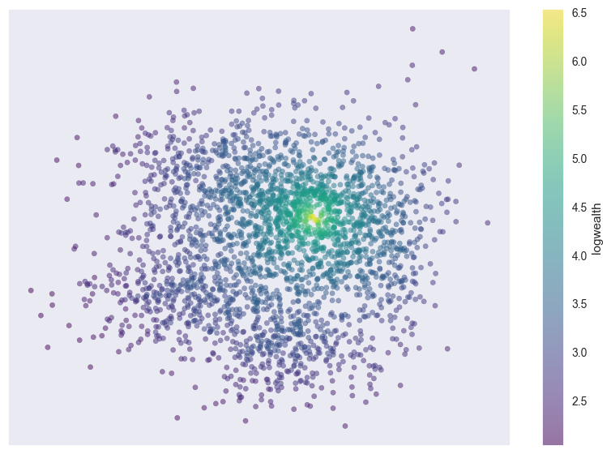
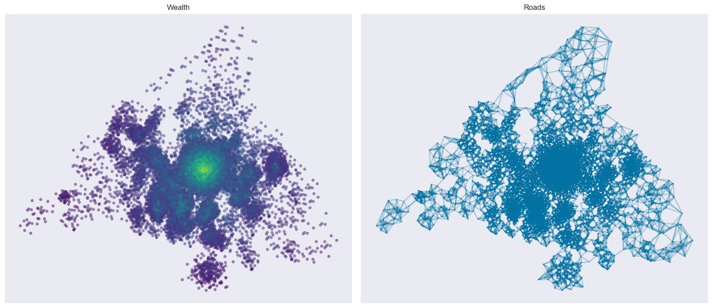

# Network Optimisation

## Introduction

There is a surprising similarity between many of the structures that we encounter and interact with in our day to day life and that of the very simplistic but powerful idea of a **graph**, or more generally, a **network**. This similarity is not only limited to the physical world, but also extends to the digital world, where we can find networks in the form of the internet, social networks, and even the human body. The most ubiquitous networks are **transportation** networks, consisting of features such as roads or railways, whose purpose is to facilitate the movement of people and goods. These networks are often **spatial**, meaning that they are located in a space, and are often **weighted**, meaning that they have a cost associated with them. In this project, we will be exploring the idea of a **transportation network**, and will be implementing an optimisation algorithm that will find the **optimal location** for a provider to maximize their potential to interact with their clients, while taking into consideration ideas such as location cost, customer density and traffic.

## The Network


### Structure

The network consists of two basic components.

#### Nodes

These are the individual *entities* of the network. They can represent anything from a person to a computer to a city. They are connected by **edges**. A node can hold additional information about itself. One of the most used attributes given to a node is **weight**; weight can represent the relative importance of a node with respect to its neighbours.


<div>
    <p style="float: right;"></p>
</div>


Let us consider an **example** of a node; a person. A person can be connected to other people, forming a social network. A person can also be connected to a server, forming a network of people and servers. Each individual could be assigned a weight, that can be ascribed a physical meaning. A simple example of a weight could be the **degree** of the node, that is, the amount of total connections that person has. However, we can also ascribe a different meaning, such as the amount of money that person has. In this latter case, note that the weight could be negative as well as any real number. A server could also be assigned a different type of weight, such as its current server load - if it were at capacity, then sending information to it would 'bounce back'.


#### Edges

An **edge** is the connection between two nodes. A node can also be connected to itself via an edge, forming a **loop**. More generally, a **cycle** is a path that begins and ends at the same node without passing through the same edges.

Much like nodes, we can also assign different types of information to edges. We can assign a **weight** to an edge, which can represent its *flow capacity*. We can also assign a **direction** to an edge, which can represent the *direction of flow*.

For **example**, a person could be connected to a server via an edge, where the direction of the edge represents the direction of information flow. In this case, the person is the *source* of the information, and the server is the *destination* of the information. The server can answer back to the person in the opposite direction. This creates a *directed network* between the node and the server. The weight of the edge can represent the amount of information that can be sent from the person to the server and vice versa. Since the weights need not be the same, we have *asymmetric connections* which simulate a network with a **bottleneck**.


### Implementation (Python)

There are 3 basic classes that we will use to implement the network. The first is the **Node** class, which represents a node in the network. The second is the **Edge** class, which represents an edge in the network. The third is the **Network** class, which represents the network itself and is the container for the nodes and edges.

#### Approach

The approach that we will take is to create a **base class** for each of the three classes, and then create **derived classes** that inherit from the base classes. This allows us to create a **generic** framework that can be used to implement different types of networks. The base classes will contain the basic functionality that is common to all networks. The derived classes will contain the additional functionality that is specific to the type of network that we are implementing.

To ensure maximal generality, we will use **inheritance** to create the derived classes. This allows us to create a **hierarchy** of classes, where the derived classes inherit from the base classes. This allows us to create a **generic** framework that can be used to implement different types of networks.

Furthermore, for most of the generic class attributes, we will use a functional approach to set its value. This allows us to **override** the function in the derived classes, and thus change the behaviour of the attribute, as well as adding dynamicity to the class.

#### Node

The Node class is a simple class that represents a node in the network. It has a single attribute that is instantiated when the object is created, that being its **id**, a unique identifier for the node. For this, we generate a random 128-bit string using the **uuid** module. The id is used to identify the node in the network, and will also be especially useful when we implement the edge class.

Since for the most part, we will almost always consider our nodes to be weighted and located in a space, we will instantiate the node with a **weight** with **None** functional value and a **location** attribute.

The **Node class** is implemented as follows:

```python

from uuid import uuid4

constant_fn = lambda x: lambda y: x # constant function
# E.g.:   constant_fn(x)(y) = x

class Node:
    def __init__(self,loc):
        self.id = uuid4().hex # generate a random 128-bit string
        self.loc = constant_fn(None) # location of the node
        self.weight = constant_fn(None) # weight of the node
```

#### Edge

The Edge class represents a link between two nodes. It has two attributes that are required to instantiate the object, that being its **source** and **destination** nodes. We use the **id** attribute of the node to identify the nodes between which the edge is created when considering the network.

Furthermore, we will also instantiate the edge with a unique **id** attribute, as well as a **weight** attribute with a **None** functional value and a **direction** attribute set by default to $0$. Direction is represented by an integer, where $0$ represents no direction, $1$ represents a directed edge from the source to the destination, and $-1$ represents a directed edge from the destination to the source.

The **Edge class** is implemented as follows:

```python

class Edge:
    def __init__(self, source, destination):
        self.id = uuid4().hex # generate a random 128-bit string
        self.source = source.id # source node
        self.destination = destination.id # destination node
        self.weight = constant_fn(None) # weight of the edge
        self.direction = constant_fn(0) # direction of the edge
```

#### Network

The Network class represents the network itself. It is a container for the nodes and edges in the network. It has two attributes that are required to instantiate the object, those being its **nodes** and **edges**, the latter of which can default to **None** (Note that an edge cannot be in the network if its corresponding nodes aren't as well). The nodes and edges are stored in lists containing the entire object itself. However, we will also create a **dictionary translator** that maps the **id** of the node/edge to the object itself. This will allow us to access the node/edge by its id, which should significantly improve efficiency.

Further, to improve efficiency and reduce computation, on class instantiation, we will also create two additional dictionaries - the first contains node **locations** as keys, and their id as values. Since only one node can occupy a location, this will allow us to quickly check if a location is occupied and/or retrieve the node in question. The second dictionary contains the entire **adjacency** information of the network. This will allow us to quickly check if two nodes are connected by an edge, together with direction information.

The **Network class** is implemented as follows:

```python

class Network:
    def __init__(self, nodes, edges=None):
        self.nodes = nodes # list of nodes
        self.edges = edges if edges else [] # list of edges
        self.node_dict = {node.id: node for node in nodes} # dictionary of nodes
        self.edge_dict = {edge.id: edge for edge in edges} # dictionary of edges
        self.node_loc_dict = {node.loc: node.id for node in nodes} # node locations
        self.adjacency_dict = {node.id: 
                              {node.id: {
                                         'edge' : [], 'dir_edge' : []
                                        } for node in self.nodes} 
                                          for node in self.nodes} 
        # adjacency information
        def populate_adjacency_dict():
            ...
```

## Toy Example: Recreating the Madrid Metro by Optimizing Node Locations

We will now use the framework we have created to implement a simple network, and then use it to find an approximate position of all the metro stations in Madrid.

The only two constraints that we will have are the metro lines themselves, and the **geographical location** only of the **first** and **final node** of each line projected onto an xy-plane. The rest of the nodes will be placed with absolutely no bearing on their geographical location. This will allow us to create a toy model that will allow us to test our framework.

**Note:** The code for this example can be found in the **madrid_metro** folder.


### Data Extraction

We use **Selenium** to extract the metro data from Wikipedia, and parse through the HTML to extract the station names, the metro lines they belong to, and the lines they connect to per station. We will only consider lines $1-10$ since the rest contain no interesting intersection with the rest of the network.

From this extraction, we obtain the names of the first and last station of each line, then extract their latitude and longitude again from Wikipedia.

### Network Creation

We create a network with the stations as nodes, and the connections between stations as edges. Since this is a simple example, *we will not consider the distance between two stations as a weight*, and we will make the naive assumption that the *stations are equidistant* (note how this toy model will still give relatively accurate predictions). We then place the entire network on an xy-plane, with no consideration for location. Note that the spaces on the vertical lines of the graph represent stations that belong to multiple metro lines (and are represented by the line with the smallest number label). Connections are not represented for visual clarity.

<div style="text-align: center;">
  
</div>

The geographical coordinates are then converted to a unitless scale using a **Mercator** projection onto a 100x100 grid. We then move the first and last station of each line to their respective transformed geographical coordinates.

The following could be considered our **initial guess** of the network configuration.

<div style="text-align: center;">
  
</div>

### Algorithm: RMSE minimization

We fix in place all the endpoints, with the objective being to slowly move the rest of the nodes to their corresponding locations. We assign a set of moves that each node can perform - a cardinal move in the **N**orth/**S**outh/**E**ast/**W**est direction by a tiny amount $\epsilon$. We then calculate the **(root) mean squared error (RMSE)** between the current network configuration and the previous one. If the RMSE improved, then we try the next node. If the RMSE is not improved, we instead revert the move before continuing onto the next. We keep track of these failures, and if a node is deemed to be *stuck*, it is removed from the node pool. We repeat this process until the RMSE is minimized to a certain threshold.

```python

class Station(Node):
    def __init__(self, name):
        super().__init__()
        self.name = name
        self.cardinal_cycle = itertools.cycle(['N', 'E', 'S', 'W'])

    def cardinal_move(self, epsilon):
      self.move(self.cardinal_cycle.next(), epsilon)

    def distance(self, other):
        return np.sqrt((self.loc[0] - other.loc[0])**2 + (self.loc[1] - other.loc[1])**2)

class Connection(Edge):
    def __init__(self, station1, station2,line):
        super().__init__(station1, station2)
        self.line = line
        self.target_weight = 2 # 2 units of error, arbitrarily chosen
        self.weight = lambda x : Station.distance(x.station1, x.station2)
        # For better accuracy, we could use spherical distance instead of euclidean distance

class Metro(Network):
    def RMSE(self,station):
    error_vector = [(station.adjacent_edge.weight - station.adjacent_edge.target_weight)**2 for adjacent_edge in station.adjacent_edges]
    return np.sqrt(np.mean(error_vector))

    def optimize(self, epsilon=0.001, threshold=0.01):
        # We fix the endpoints, and move the rest of the nodes
        # We keep track of the nodes that are stuck, and remove them from the pool
        # We repeat this process until the RMSE is minimized to a certain threshold
        # We return the final RMSE
        ...

```

The intention of this algorithm is to pull the nodes towards their corresponding locations, while also allowing for some randomness in the process. The randomness is introduced by the fact that the nodes are not moved in a deterministic manner, but rather in a random order.

After a few iterations, we obtain the following plot:

<div style="text-align: center;">
  
</div>

### Results

We can see that the algorithm has successfully placed the nodes in their corresponding locations, with the exception of a few outliers and bugs. The algorithm is also not perfect, and is prone to getting stuck in local minima, or rather, the geography the the real metro line does not follow minima. However, the algorithm has placed the nodes in their corresponding locations with a high degree of accuracy.

Since this model was intentionally simplistic, we have no good way of measuring the accuracy of the model and its result. However, we can instead superimpose the result of the algorithm onto a map of Madrid, and visually compare it to the actual metro map.

<div style="text-align: center;">
  
</div>

Most of the stations have been placed in an interpretable manner. The algorithm is not able to account for bends, since they are inherently *unnatural* within the context of minimization, but not within the context of practical use. This is a limitation of the model, and is not a flaw in the algorithm.


# Intercity Distribution Optimisation

## Introduction

For the second part of the project, we will be considering how to optimise the location of distributors and/or vendors in order to maximise the proximity to the greatest number of potential customers, while accounting for variables such as the cost of transportation and the cost of the distributors themselves.

Since such detailed data is not available, we will be using a simplified model of a city, where customers and distributors are represented by points on a 2D plane. The cost of transportation is represented by the distance between the customer and the distributor. We will be gradually adding more complexity to the model, and simultaneously improve the algorithm to account for it.

## Model: Procedural Generation of Cities

The first step is to generate a city. In order to recreate the randomness of a real-world scenario, we will be using a mixture of statistical distributions to allocate nodes randomly within the city.

#### Uniform Distribution of Population Centers

We define a population center as a point in the city where a large number of people live. We will be using a uniform distribution to allocate these population centers. The number of population centers is determined by the population of the city. We compute the midpoint of these population centers, and use it as the center of the city. To each population center, we assign a population size, which is determined by a Gaussian distribution.

#### Gaussian Distribution of Customers and Distributors

We define a customer as a point in the city where a small number of people live. We will be using a Gaussian distribution to allocate these customers. The variance of the Gaussian distribution is determined by the population size of the population center that it is associated with. The city center is assigned a larger variance, in order to account for the fact that it is a more densely populated area. Distributors will be elements of this network to be picked in the future.

#### Poisson Distribution of Roads

We define a road as a connection between two customers. We will be using a Poisson distribution to allocate these roads - out of its $n$ closest neighbors, we pick $m$ of them where $n$ and $m$ depend on the population density of the area near it. The weight of the road is determined by the **manhattan distance** between the two customers. Later on, we will also add a density factor to the weight of the road, in order to account for the fact that city centers are more congested.

#### Lognormal Distribution of Wealth

We assign wealth, or the purchasing power of the customer, to each customer. We will be using a lognormal distribution to allocate these wealth values. The mean of the distribution is determined by two factors: the population size of the population center that it is associated with, and the distance from the city center. The variance of the distribution is determined by the population size of the population center that it is associated with.


### Design

The design of the algorithm of the procedural generation of cities can be summarised by the following flowchart:


The network is a collection of vertices and edges. The vertices are connected by edges. The edges can be weighted, directed and/or weighted. The network can be used to find the optimal flow between two vertices. The flow is a path between two vertices. The flow is optimized by finding the path with the lowest weight.

### Results

We present a few images of the cities generated by the algorithm.

<div style="text-align: center;">
  

  

  

  

  

  

</div>
We can visualize the connections as well in the following image:

<div style="text-align: center;">
  
</div>


## Model: Optimisation of Supply Chain

### Clustering

We will be using a clustering algorithm to group the customers into clusters. The algorithm will be based on the **K-Means algorithm**, but will be modified to account for the fact that the customers are not equally distributed in the city. We will be using the **manhattan distance** to compute the distance between two customers.

The only reasonably perfectly-computable example is the case that there is one distributor. In this case, the algorithm will simply return the centroid of the city. From here on out, we will be considering the case where there are multiple distributors. In order to increase efficiency at the cost of accuracy, we will be using a **Monte Carlo** approach to the algorithm. We will be using a random sample of the customers to compute the centroid of the cluster. 

The following image shows the $n=1$ case, where the centroid of the city is returned. The node labelled **Cluster Center** is the usual K-Means centroid. The **Perfect Distributor** is the manhattan-centroid of the city. The **Optimal Distributor** is a result of the Monte Carlo approach.

<div style="text-align: center;">
  
</div>

The $n=10$ case is also shown. Note that the **Perfect Distributor** would take approximately $3000^{10}$ seconds to compute, therefore only the Monte Carlo approach is feasible.

<div style="text-align: center;">
  
</div>

Before moving on, we also show the case where our distributor already has locations present, and our intention is to add more distributors to the network in a way that maximises coverage. The **red** nodes are the existing distributors, and the **green** nodes are the new distributors.

<div style="text-align: center;">
  
</div>


### Adding Cost and Wealth to the Model

We also consider the cost for a distributor to be present in certain areas of the city. We add a cost factor to the weight of the road, which is determined by the distance from the city center. We also add a wealth factor to the weight of the road, which is determined by the wealth and density of the nearby customers. For the following, we will be considering the $n=5$ case.


The first image shows the case where the cost factor is not considered in **red**, and the **pink** nodes are after the cost factor is considered. Notice how the pink nodes move away from the city center.

<div style="text-align: center;">
  
</div>

The second image shows the case where the wealth factor is not considered in **pink**, and the **orange** nodes are after the wealth factor is considered as well. The orange nodes now inch closer to the city center, but still prefer to remain not entirely within the expensive inner regions.

<div style="text-align: center;">
  
</div>

### Adding Traffic to the Model

Finally, we consider the traffic factor in the model. We add a traffic factor to the weight of the road, which is determined by the density of its location, as well as the amount of roads that are connected to it. The algorithm *turns off* certain roads, and allocates larger weight to denser roads. 

The following image shows the case where the traffic factor is not considered in **orange**, and the **yellow** nodes are after the traffic factor is considered. The yellow nodes once again move away from large agglomerations, but still prefer to be nearer smaller agglomerations but sparser areas.

<div style="text-align: center;">
  
</div>


## Case Study: Madrid

We will use the previous work as a base to work with a real-world example. We have only two available data sets: the rough geographical location of the municipalities of Madrid, together with its population, and also the location of veteranary clinics in Madrid. Our objective will be to find the optimal location for a new veteranary clinic in Madrid.

### Data

We only have the coordinates of the municipalities, so we have to procedurally generate the city, using a slightly modified algorithm that fits better with the type of data. The following image shows the municipalities of Madrid:

<div style="text-align: center;">
  

</div>

We fill out the city:

<div style="text-align: center;">
  


Finally, we also have the coordinates of the veteranary clinics in Madrid, which we superimpose on the city:

<div style="text-align: center;">
  

</div>

### Results

We follow the same steps as before. First, find the naive optimal distribution of clinics (that is, the distribution that minimises the total distance travelled to the clinics). 

In the following, the original image is shown to the left, while the right image shows the effect of the algorithm. Notice how the algorithm has moved the clinics away from the city center, towards a more even distribution. Of course, this is not the optimal distribution, but it is a good starting point.

<div style="text-align: left;">
  

Next, we take the cost factor into account. Our clinic distribution is now sparser, but not closer to the original.

<div style="text-align: left;">
  

Taking the wealth factor into account, we get the following result:

<div style="text-align: left;">
  

Finally, we take the traffic factor into account.

<div style="text-align: left;">
  

Although still far away from the solution, since there is a lot of uncertainty due to procedural generation, we cannot confirm if our last step is an improvement or not. We can, however, confirm that the algorithm is working as intended, as the last image resembles the original image, but with the clinics distributed more evenly.